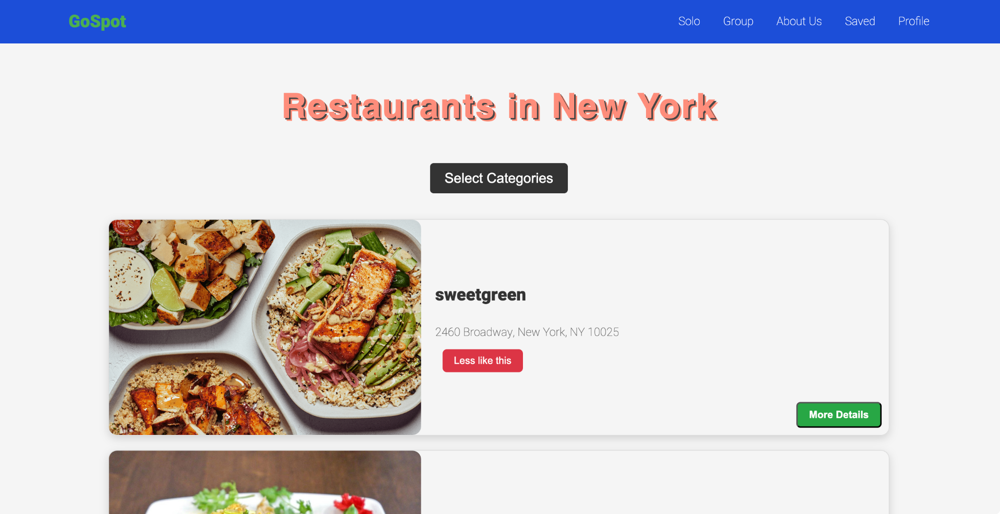

# GoSpot

GoSpot is a dynamic restaurant recommendation system designed for users in New York City. By learning from your restaurant preferences and behavior, GoSpot intelligently recommends new restaurants that match your taste. You can use GoSpot to either find individual restaurant recommendations or join group recommendations, where the system generates suggestions based on the collective preferences of a group. This solution leverages both backend and frontend implementations across web and mobile platforms.

## Features

### 1. **Personalized Restaurant Recommendations**
   - GoSpot learns your behavior and preferences over time.
   - It suggests restaurants you are likely to enjoy based on your previous likes and interactions.
   - Recommendations are tailored to New York City restaurants, leveraging a rich dataset of locations across the city.

### 2. **Group Recommendations**
   - Form a group with friends, colleagues, or family.
   - Get restaurant recommendations based on the combined preferences (vectors) of all group members.
   - Ideal for group dining experiences where everyone’s taste is taken into account.

### 3. **Web Frontend**
   - The web version of GoSpot is fully functional and allows users to explore restaurant options.
   - Users can view restaurant details and make selections such as "more details" or "less like this" to help refine their preferences.
   
### 4. **Mobile App (Partially Functional)**
   - A mobile app is being developed for users who prefer discovering restaurants on the go.
   - The app will offer the same personalized recommendation features once fully functional.

## Technology Stack

### Backend
   - **Flask**: A Python-based web framework used to build the backend API.
   - **MongoDB**: Used to store user data, restaurant data, and interactions.
   - **Machine Learning**: Custom models built to learn user preferences based on their restaurant choices. The models use techniques like cosine similarity and vector embeddings to calculate the nearest neighbors for personalized recommendations.
   - **Annoy**: Utilized for efficient nearest neighbor search to find restaurants similar to user preferences.

### Web Frontend
   - **React.js**: The web frontend is built using React.js, offering a sleek and intuitive interface for users to navigate restaurant recommendations, group suggestions, and saved preferences.
   - **CSS**: Styled using custom CSS to create a clean and responsive user interface.

### Mobile Frontend
   - **React Native**: The mobile application is being developed using React Native, allowing cross-platform functionality between iOS and Android. Currently, the app is partially functional, with core features still under development.

## Screenshots



## How It Works

1. **Individual Recommendations**: 
   - GoSpot tracks user interactions with restaurant data (e.g., likes, views, and saved items). The system adjusts and refines future recommendations based on these interactions. 
   - A nearest-neighbor search (powered by Annoy) is used to find restaurants that are similar to a user’s previously liked or saved places.

2. **Group Recommendations**: 
   - Users can form a group and the system will compute recommendations based on the combined preferences of all group members. Each group is assigned a unique ID for easy sharing and access.
   - This feature is especially useful for group outings or family gatherings where everyone’s taste is considered.

## How to Run

_**Backend Instructions**_
   ```sh
    cd backend 
    Setting up virtual environment, you dont have to do this but I mean why not 
    python3 -m venv path/to/venv

    ACTIVATION 
    source path/to/venv/bin/activate

    then install the requirenments by 
    python3 -m pip install -r requirements.txt

    to run 
    python3 app.py. 
    cd ..
    Then, split terminal to run FrontEnd
   ```

_**FrontEnd Instructions**_
 ```sh
    INSTALL NODE AND NPM
    https://nodejs.org/en/download/package-manager
    https://radixweb.com/blog/installing-npm-and-nodejs-on-windows-and-mac
    or just seearch up how to install node and NPM 

    OPTIONAL, install node version manager, NVM 
    https://www.freecodecamp.org/news/node-version-manager-nvm-install-guide/

    then 
    npm install 
    then 
    npm run dev
   ```

## Future Enhancements

- **Improved Mobile App**: We aim to fully develop the mobile app with the same functionality as the web version. This will include recommendation features, user profile management, and group interactions.
- **More Group Features**: Expanding on the group recommendation system to include real-time collaboration and feedback among group members.
- **Expanded Datasets**: Adding more cities and restaurant data to provide recommendations beyond New York City.

